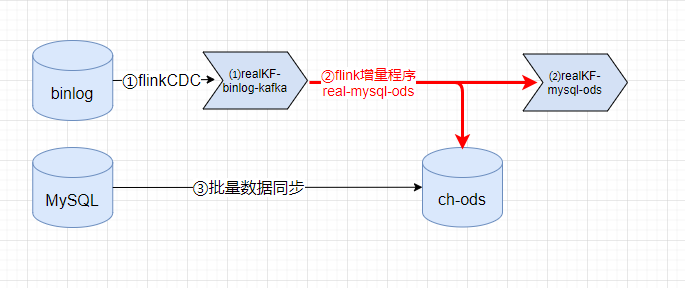

# flink-use-note

<p align="left">
  
</p>

## 介绍

Flink Java 使用笔记，Flink源码解析，数据处理逻辑记录，Flink Connectors 部分参考[纯钧](https://github.com/DTStack/chunjun)
，将不同的数据库链接封装在[flinkuse-core](flinkuse-core/src/main/java/com/flinkuse/core)，[flinkuse-cases](flinkuse-cases/src/main/java/com/flinkuse/cases)列举Flink算子使用样例和流式数据处理逻辑样例。

## 基于 Flink 大数据平台架构

| 版本 | 架构 | 总结 |
| ---- | ---- | ---- |
| V1 |  |  |
| V2 |  |  |
| V3 |  |  |
| V4 |  |  |
| V5 |  |  |

Flink + Kubernetes + ds + Dinky + Clickhouse + Doris + Paimon  
Flink Kubernetes Operator


## 提交方式
如下提交方式中程序用到的所有参数都可以配置在`flinkuse.properties`文件中，比如clickhouse的用户名密码等配置，关于Connectors配置的key
都写死在[ConfigKeys](flinkuse-core/src/main/java/com/flinkuse/core/constance/ConfigKeys.java)类里可以参照[flinkuse.properties](flinkuse.properties)
进行配置，如果通过main函数传入的key与配置文件里的key有冲突以main函数传入的为主。

```
$FLINK_HOME/bin/flink run-application -t kubernetes-application -p 1 \
    -c com.flinkuse.cases.operatorlogic.ReduceDistinct \
    -Dkubernetes.cluster-id=$K8S_CLUSTER_NAME \
    -Djobmanager.memory.process.size=1024m \
    -Dtaskmanager.memory.process.size=1024m \
    -Dkubernetes.pod-template-file=$POD_TEMPLATE_PATH \
    -Drest.port=8081 \
    -Dkubernetes.container.image=flink:1.15.4 \
    local://app.jar --conf /flinkuse.properties
```

## source

在Flink-v1.18之前的版本有两套API，DataStream API（有界或无界流数据）以及 DataSet API（有界数据集）,
分别讨论这两种 API source 的定义方式。

### DataSet
用`ExecutionEnvironment.createInput()`创建source，重写抽象类`RichInputFormat`连接不同的数据库。
比如腾讯云的COS[`CosOutputFormat`](flinkuse-core/src/main/java/com/flinkuse/core/connector/cos/CosOutputFormat.java)

### DataStream
`StreamExecutionEnvironment`创建source有三种方式，`StreamExecutionEnvironment.createInput()`、`StreamExecutionEnvironment.addSource()`
以及`StreamExecutionEnvironment.fromSource()`。
- `createInput()`方法需要重写抽象类`RichInputFormat`，但是只支持无界数据流不可以将RuntimeExecutionMode设置为BATCH。
- `addSource()`方法需要实现`SourceFunction`类，同样addSource也只支持无界数据流不可以将RuntimeExecutionMode设置为BATCH。
- `fromSource()`方法需要实现`Source`类

### 总结
重写抽象类`RichInputFormat`的连接方式可以分别应用在 DataStream API 以及 DataSet API，应用在 DataStream API 时要想自定义运行模式除了使用
fromSource方法还可以用以下代码的方式自定义`Boundedness`（有界流/无界流）：
```
StreamExecutionEnvironment env = StreamExecutionEnvironment.getExecutionEnvironment();
InputFormatSourceFunction<String> function =
                new InputFormatSourceFunction<>(new CosInputFormat(cosObjs), BasicTypeInfo.STRING_TYPE_INFO);

DataStream<String> s = new DataStreamSource<>(env,
        BasicTypeInfo.STRING_TYPE_INFO,
        new StreamSource<>(function),
        false,
        "COS Source",
        Boundedness.BOUNDED);
        
s.print();
```
在Flink-v1.18版本中`InputFormatSourceFunction`类已经带有删除线，自定义source最好使用fromSource方法实现Source类。

## sink
常用的数据库 Flink DataStream Connectors 都支持。
## AsyncIO
继承`RichAsyncFunction`类实现`asyncInvoke`等方法，需要在`asyncInvoke`方法里实现异步调用外部系统，比如[JdbcAsyncFormat](flinkuse-core/src/main/java/com/flinkuse/core/connector/jdbc/JdbcAsyncFormat.java)。

**重要提示：** 第一次调用 ResultFuture.complete 后 ResultFuture 就完成了。 后续的 complete 调用都将被忽略。

## 批流一体

[到底什么是流批一体?](https://docs.qq.com/doc/DWFpRTE1vTmtNbk9n)

DataStream API 支持不同的运行时执行模式（STREAMING/BATCH），DataStream API 和 DataSet API 有很大的区别，想用 DataStream API 的BATCH
执行模式实现与 DataSet API 相同的功能时就会发现，DataSet API 的一些算子 DataStream API 并没有提供：
- distinct算子 DataStream API 就没有，怎样实现相同的功能呢？可以参考[ReduceDistinct](flinkuse-cases/src/main/java/com/flinkuse/cases/operatorlogic/ReduceDistinct.java)类
